# 🍕 Zomato Clone — Full-Stack Food Delivery Platform

A production-grade food delivery platform built with **Angular 17**, **FastAPI microservices**, **MongoDB**, and **Nginx** as API Gateway — containerised with Docker and monitored end-to-end.

---

<div align="center">
  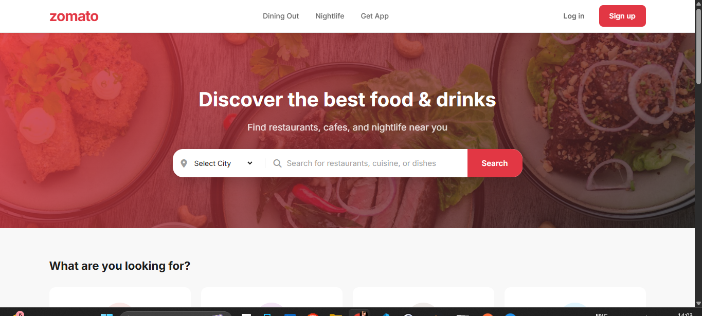
  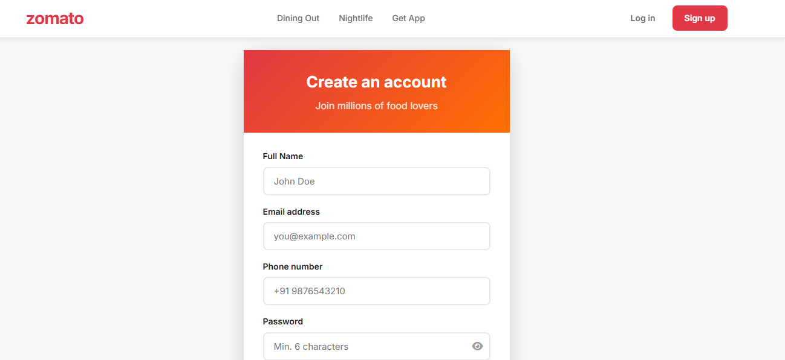
  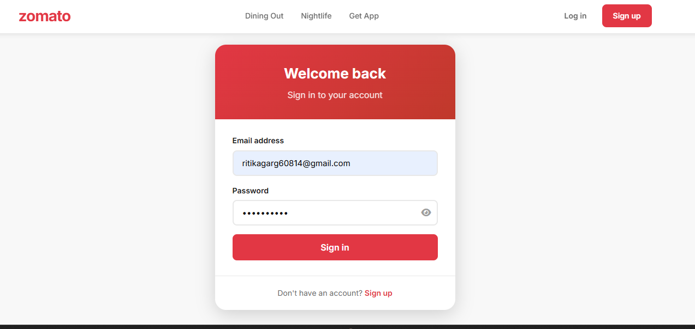
  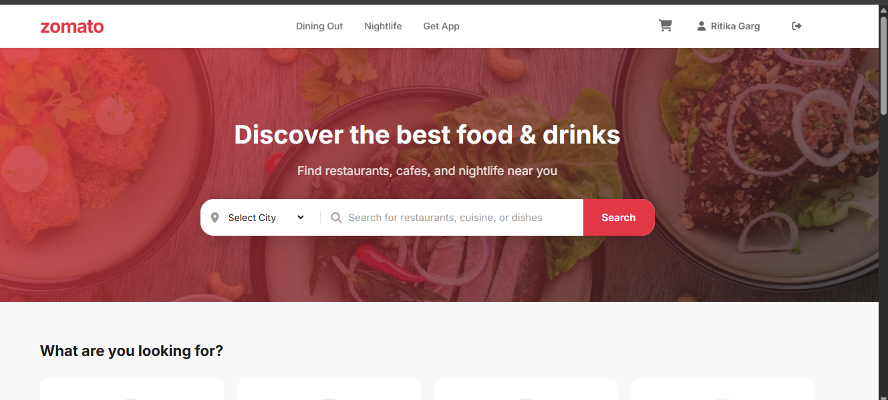
  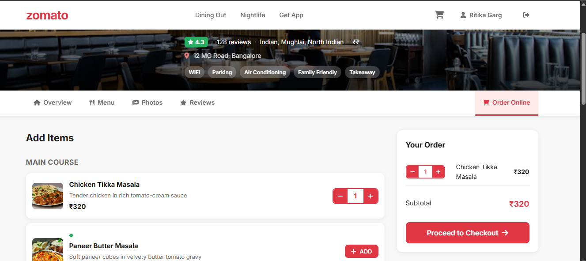
  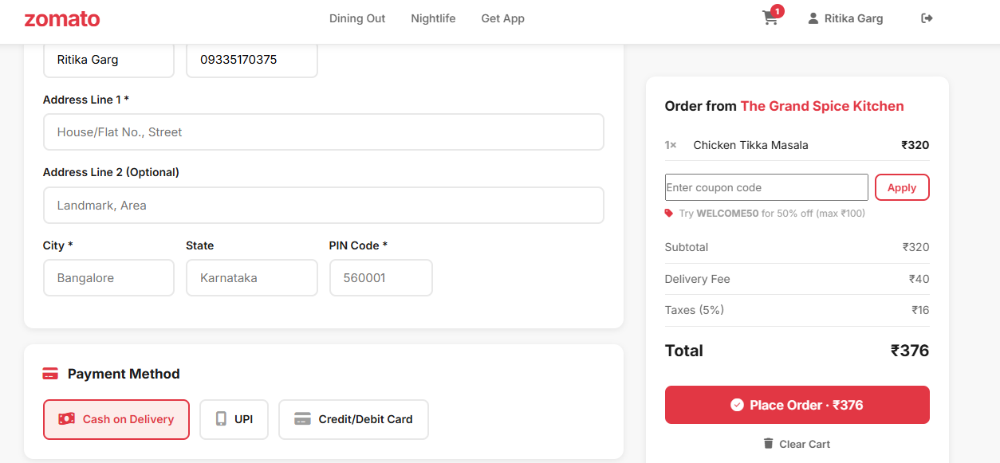
  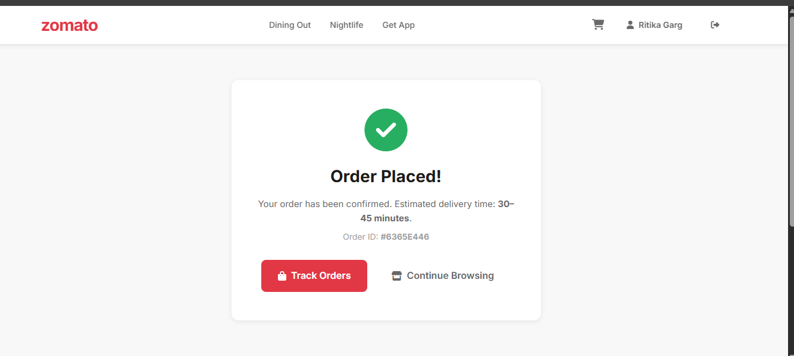
</div>

---

## 🛠️ Tech & DevOps Stack

| Layer | Tool | Role in This Project |
|---|---|---|
| **Frontend** | Angular 17 | Standalone SPA with lazy loading + signals |
| **API Gateway** | Nginx | Routes `/api/*` to correct microservice, serves static files |
| **Backend** | FastAPI × 3 | Independent microservices — user, restaurant, order |
| **Database** | MongoDB × 3 | Isolated DB per service (no shared state) |
| **Containerisation** | Docker + Compose | Single-command local stack, reproducible builds |
| **CI/CD** | GitHub Actions | Build → test → push image on every push to `main` |
| **GitOps** | ArgoCD | Watches Helm chart in Git, auto-deploys to K8s |
| **K8s Packaging** | Helm | Templated manifests, one chart for all environments |
| **Metrics** | Prometheus | Scrapes `/metrics` from all 3 FastAPI services |
| **Dashboards** | Grafana | Order volume, latency, error rate, cart abandonment |

---

## 🔄 CI/CD Pipeline

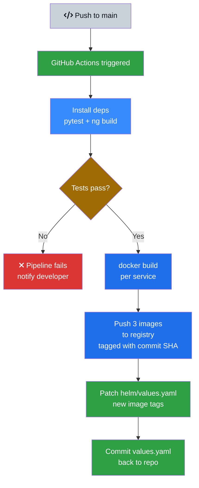

> Three separate Docker images are built — one per microservice. Each is tagged with the Git commit SHA so you can trace any deployed pod back to an exact commit.

---

## 🚀 GitOps Flow — ArgoCD

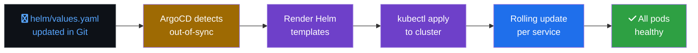

> No `kubectl apply` commands run manually. Git is the single source of truth. Rolling back = reverting a commit.

---

## ☸️ Kubernetes — Helm Chart Layout

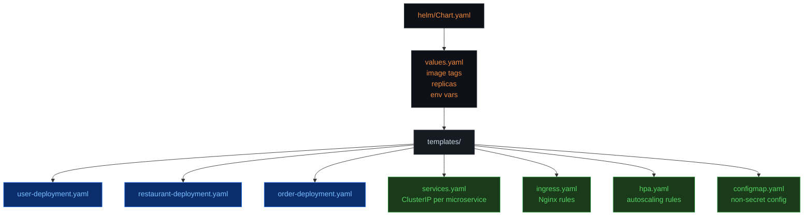

> Same Helm chart is used for `dev`, `staging`, and `prod` — only `values.yaml` changes per environment.

---

## 📊 Monitoring Pipeline

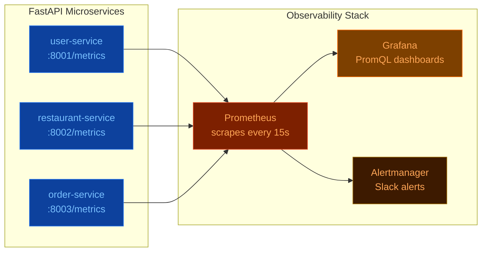

**Grafana dashboards track:**
- Orders placed per minute / hour
- API response time (p50, p95, p99) per service
- Cart abandonment rate
- MongoDB connection pool usage
- Pod CPU and memory per microservice

---

## 🗺️ Full System Architecture

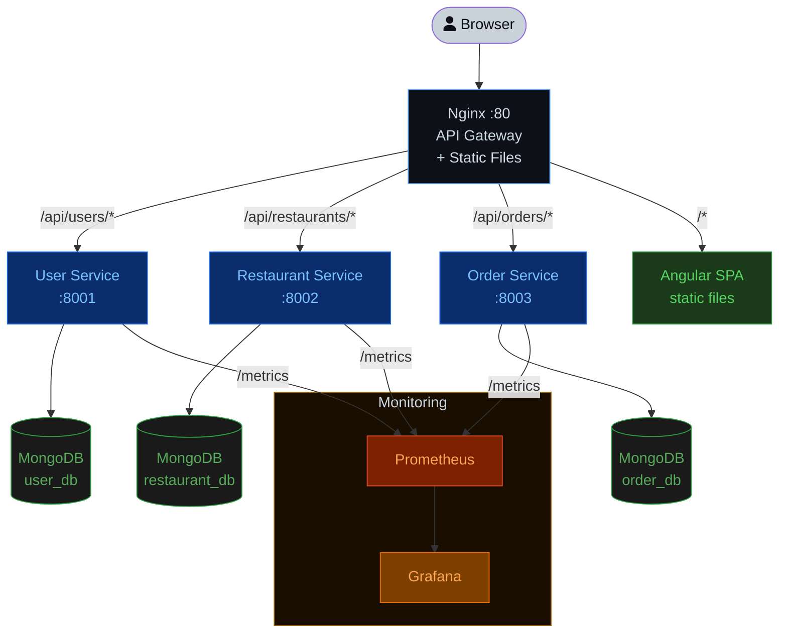

---

## 🔍 How the Nginx Gateway Works

```nginx
# nginx/nginx.conf — simplified
server {
    listen 80;

    # Serve Angular SPA
    location / {
        root /usr/share/nginx/html;
        try_files $uri $uri/ /index.html;   # SPA fallback
    }

    # Route to microservices
    location /api/users/ {
        proxy_pass http://user-service:8001/;
    }
    location /api/restaurants/ {
        proxy_pass http://restaurant-service:8002/;
    }
    location /api/orders/ {
        proxy_pass http://order-service:8003/;
    }
}
```

Angular makes all calls to `/api/*` — it never hardcodes service ports. Nginx handles the routing internally. This means the frontend doesn't change whether running locally or in Kubernetes.

---

## 📁 Project Structure

```
zomato-clone/
├── user-service/          # FastAPI — Auth, JWT, profiles (port 8001)
│   ├── main.py
│   ├── models.py
│   ├── database.py
│   ├── requirements.txt
│   └── Dockerfile
│
├── restaurant-service/    # FastAPI — Restaurants, menus, reviews, photos (port 8002)
│   ├── main.py
│   ├── models.py
│   ├── database.py
│   ├── requirements.txt
│   └── Dockerfile
│
├── order-service/         # FastAPI — Cart, orders, history (port 8003)
│   ├── main.py
│   ├── models.py
│   ├── database.py
│   ├── requirements.txt
│   └── Dockerfile
│
├── frontend/              # Angular 17 standalone SPA
│   └── src/app/
│       ├── components/
│       │   ├── home/
│       │   ├── auth/
│       │   ├── user-profile/
│       │   ├── order/
│       │   └── restaurant/         # Nested layout with tabs
│       │       ├── restaurant-menu/
│       │       ├── restaurant-photos/
│       │       ├── restaurant-review/
│       │       └── restaurant-order/
│       ├── services/               # API calls, auth, toast
│       ├── guards/                 # Route protection
│       └── models/                 # TypeScript interfaces
│
├── nginx/
│   ├── nginx.conf         # Gateway config
│   └── Dockerfile
│
├── helm/                  # Kubernetes Helm chart
│   ├── Chart.yaml
│   ├── values.yaml
│   └── templates/
│
├── .github/workflows/
│   └── deploy.yml         # CI pipeline
│
└── docker-compose.yml     # Local dev stack
```

---

## ⚡ Quick Start

### Docker Compose (recommended)

```bash
git clone <your-repo>
cd zomato-clone
docker-compose up --build
```

Starts everything — 3 MongoDB instances, 3 FastAPI services, Angular dev server, and Nginx.

| URL | What it opens |
|-----|---------------|
| http://localhost | App via Nginx (production-like) |
| http://localhost:4200 | Angular dev server (hot reload) |
| http://localhost/api/users | User service |
| http://localhost/api/restaurants | Restaurant service |
| http://localhost/api/orders | Order service |

### Without Docker

```bash
# Start each service in a separate terminal
cd user-service && pip install -r requirements.txt && uvicorn main:app --reload --port 8001
cd restaurant-service && pip install -r requirements.txt && uvicorn main:app --reload --port 8002
cd order-service && pip install -r requirements.txt && uvicorn main:app --reload --port 8003

# Frontend
cd frontend && npm install && npm start
```

---

## 📌 API Endpoints

### User Service (`/api/users`)

| Method | Endpoint | Auth | Description |
|--------|----------|:----:|-------------|
| POST | `/register` | ❌ | Register new user |
| POST | `/login` | ❌ | Login, returns JWT |
| GET | `/me` | ✅ | Get current user profile |
| PUT | `/me` | ✅ | Update profile |
| GET | `/validate` | ✅ | Validate JWT (internal use) |

### Restaurant Service (`/api/restaurants`)

| Method | Endpoint | Auth | Description |
|--------|----------|:----:|-------------|
| GET | `/` | ❌ | List + filter restaurants |
| POST | `/` | ✅ | Create restaurant |
| GET | `/{id}` | ❌ | Restaurant details |
| PUT | `/{id}` | ✅ | Update restaurant |
| DELETE | `/{id}` | ✅ | Soft-delete |
| GET/POST | `/{id}/menu` | ❌/✅ | View or add menu items |
| GET/POST | `/{id}/reviews` | ❌/✅ | View or submit reviews |
| GET/POST | `/{id}/photos` | ❌/✅ | View or upload photos |

**Filter params on `GET /`:** `category`, `city`, `search`, `price_range`, `skip`, `limit`

### Order Service (`/api/orders`)

| Method | Endpoint | Auth | Description |
|--------|----------|:----:|-------------|
| GET | `/cart` | ✅ | Get active cart |
| PUT | `/cart` | ✅ | Add / update cart items |
| DELETE | `/cart` | ✅ | Clear cart |
| POST | `/` | ✅ | Place order |
| GET | `/` | ✅ | Order history |
| PATCH | `/{id}/cancel` | ✅ | Cancel order |

---

## ✅ Feature Checklist

**Backend**
- [x] JWT auth with bcrypt hashing across all services
- [x] Restaurant CRUD with owner-only write access
- [x] Menu items with veg/non-veg/vegan flags
- [x] Ratings auto-calculated from submitted reviews
- [x] Cart persisted server-side (survives page refresh)
- [x] Coupon code support at checkout (`WELCOME50`)
- [x] Auto-seeded sample data on first run
- [x] MongoDB indexes for fast filtering queries

**Frontend**
- [x] Angular 17 standalone components + lazy loading
- [x] Angular Signals for reactive cart state
- [x] JWT injected automatically via HTTP interceptor
- [x] Route guards on authenticated pages
- [x] Nested restaurant layout with shared tab navigation
- [x] Lightbox photo gallery
- [x] Multi-step restaurant creation form
- [x] Live cart counter in navbar
- [x] Toast notification system
- [x] Fully responsive — mobile first
- [x] Veg filter on menu page

---

## 🔒 Security Checklist (Before Production)

- [ ] Replace `SECRET_KEY` in all 3 services with a 32+ character random string
- [ ] Enable MongoDB authentication and use credentialed connection strings
- [ ] Add HTTPS via Nginx + Certbot (Let's Encrypt)
- [ ] Set strict `CORS` origins — remove wildcard

---

## 🧪 Test Data

5 sample restaurants are seeded automatically on first run.

**Test coupon:** `WELCOME50` — 50% off, max ₹100 discount

---

## 📦 Production Build

```bash
cd frontend
npm run build
# Output goes to: frontend/dist/zomato-clone/browser/
# Copy this into the nginx Dockerfile's COPY step

docker-compose up --build
```
